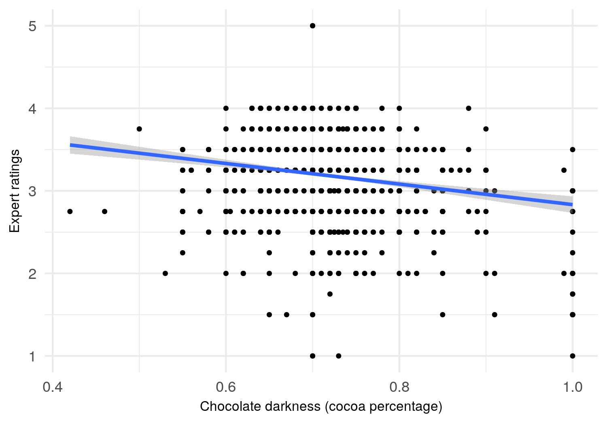

```{r echo = FALSE}
suppressPackageStartupMessages(library(tidyverse))
suppressPackageStartupMessages(library(knitr))
suppressPackageStartupMessages(library(here))
```


Chocolate bar is one of the most popular treats around the world, but not all chocolate bars are made the same. Some chocolate bars are made with a high concentration of cocoa beans and are thus considered more dark, while some chocolate bars are far less concentrated in terms of cocoa and are thus considered more light.

This begs a question - are darker chocolate bars simply better? For instance, in the eyes of the experts, are chocolate bars with 99% cocoa concentration simply better than chocolate bars with only 70% cocoa concentration?  

This analysis would explore the relationship between chocolate darkness (cocoa percentage) and chocolate expert ratings.

### Data set

We examined the expert ratings of 1,795 chocolate bars compiled by Brady Brelinski, a Founding Member of the [Manhattan Chooclate Society](http://flavorsofcacao.com/index.html). A detailed description of the data set can be found on [Kaggle](https://www.kaggle.com/rtatman/chocolate-bar-ratings). We were particularly interested in two variables in the data - chocolate darkness (cocoa percentage) and expert ratings.

We began our analysis by examining each variable individually.

### Chocolate darkness

First, we examined the chocolate darkness variable visually.

```{r echo = FALSE, message = FALSE}
# visualize distribution of chocolate darkness
include_graphics("../results/darkness_dist.jpg")
```

*Figure 1.* Distribution of chocolate darkness.

We also examined chocolate darkness numerically.

*Table 1.* Descriptive statistics of chocolate darkness. 

```{r echo = FALSE, message = FALSE}
# descriptive stats of chocolate darkness
darkness_stats <- read_csv("../results/darkness_stats.csv")
kable(darkness_stats)
```

Note that `q1` represents the 25% quantile, and `q3` represents the 75% quantile.

Both visual and numerical examinations revealed that the vast majority of chocolate bars in the data set had a cocoa concentration of about 70%. The most concentrated chocolate bars in the data set attained 100% cocoa purity, whereas the least concentrated chocolate bars had a cocoa percentage of only 42%. The distribution of chocolate darkness is somewhat normal.

### Chocolate expert ratings

Next, we examined chocolate expert ratings visually.

```{r echo = FALSE, message = FALSE}
# visualize distribution of chocolate ratings
include_graphics("../results/rating_dist.jpg")
```

*Figure 2.* Distribution of chocolate expert ratings.

We also examined chocolate expert ratings numerically.

*Table 2.* Descriptive statistics of chocolate darkness. 

```{r echo = FALSE, message = FALSE}
# descriptive stats of chocolate ratings
rating_stats <- read_csv(here("results/rating_stats.csv"))
kable(rating_stats)
```

Note that `q1` represents the 25% quantile, and `q3` represents the 75% quantile.

Each chocolate bar was rated by experts using a [Likert scale](https://en.wikipedia.org/wiki/Likert_scale). Some of the main encodings were: 1 is unpleasant, 2 is disappointing, 3 is satisfactory (3.75 is praiseworthy), 4 is premium, and 5 is elite. A more detailed description of the rating system can be found on [Kaggle](https://www.kaggle.com/rtatman/chocolate-bar-ratings/home).

Most chocolate bars in the data set were given a rating of around 3 to 3.5, with 1 being the lowest rating given, and 5 being the highest rating given. The distribution of chocolate expert ratings seemed to be slightly left-skewed.

### Chocolate darkness and expert ratings

Let's explore the relationship between chocolate darkness and expert ratings. Expert ratings is an ordinal variable with more than five categories. For this reason, we would first treat expert ratings simply as a continuous variable, followed by an analysis in which it would also be treated as a categorical variable.

#### Expert ratings as a continuous variable

For this part of our analysis, we would explore the relationship between chocolate darkness and expert ratings, under the assumption that their relationship to be linear, and that expert ratings to be a continuous variable.

```{r echo = FALSE, message = FALSE}
# visualize darkness and rating

```

*Figure 3.* Chocolate darkness and expert ratings. Grey section represents 95% confidence intervals for the line of best fit (blue line), generated using linear regression.

We also computed the [Pearson's correlation coefficient](https://en.wikipedia.org/wiki/Pearson_correlation_coefficient) and its p-value between the two variables.

*Table 3.* Pearson's correlation coefficient and its p-value

```{r echo = FALSE, message = FALSE}
# compute pearson correlation
cor_pearson <- read_csv(here("results/cor_pearson.csv"))
kable(cor_pearson)
```

There was a weak and negative correlation between the two variables (r = -.1648, n = 1793, p < 0.0001). Both `Figure 3.` and the results in `Table 3.` seemed to be suggesting that chocolate darkness is weakly and negatively associated with chocolate expert ratings. In other words, as the cocoa percentage of chocolate bars increases, chocolate experts tend to give somewhat lower ratings.

#### Expert ratings as a categorical variable

We would next treat chocolate expert ratings as a categorical variable. To simplify comparisons, this analysis further categorized chocolate bars with 3 or lower ratings as `low quality` chocolate (n = 790), and chocolate bars with greater than 3 ratings as `high quality` chocolate (n = 1005).

We then compared the mean chocolate darkness (cocoa percentage) between the two expert ratings or quality groups.

```{r echo = FALSE, message = FALSE}
# visualize darkness and rating

```

*Figure 4.* Mean chocolate darkness (cocoa percentage) by expert ratings groups. Error bars represent 95% confidence intervals for each mean estimate.

As suggested by `Figure 4.`, high quality chocolate bars seemed to have lower cocoa concentration. Let's formally test this observation by conducting a [Welch's t-test](https://en.wikipedia.org/wiki/Welch%27s_t-test). We chose to use a Welch's t-test because the two chocolate quality groups differed in sample size, and we assumed that the variance of the two quality groups to be different. 

We would be testing the following null and alternative hypothesis:

$H_0$: The mean chocolate darkness (cocoa percentage) of the high quality chocolate is _no different_ than that of the low quality chocolate.

$H_A$: The mean chocolate darkness (cocoa percentage) of the high quality chocolate is _different_ than that of the low quality chocolate. 

*Table 4.* Welch's t-test and its p-value

```{r echo = FALSE, message = FALSE}
# compute t-test
ttest <- read_csv(here("results/ttest.csv"))
kable(ttest)
```

As indicated by `Table 4.`, there was enough evidence to reject the null hypothesis. There was a significant difference in the mean cocoa percentage for low quality (M = 0.7242, SD = 0.0765) chocolate bars and high quality (M = 0.711, SD = 0.0497) chocolate bars; t(1288) = -4.0755, p < 0.0001. In other words, low quality chocolate bars on average tend to be more dark, comparing to high quality chocolate bars.

### Summary

We observed that chocolate experts tend to give somewhat lower ratings as chocolate became more dark. We also observed that low quality chocolate tends to be more dark than high quality chocolate. Both observations suggest that darker chocolate bars are not necessarily better chocolate bars.

### Limitations and future directions

There were a number of limitations with the current analysis.

We have not yet considered the scenarios in which the relationship between chocolate darkness and ratings could be non-linear. For instance, maybe experts prefer chocolate that is not too dark, or not too light, but with just the right amount of cocoa. We can explore these scenarios in the future by computing [Kendall's tau](https://en.wikipedia.org/wiki/Kendall_rank_correlation_coefficient) correlation coefficient instead, or by fitting a smooth line over our scatter plot using [LOESS](https://en.wikipedia.org/wiki/Local_regression) instead.

We also did not consider other factors that can influence the ratings of the chocolate bars, such as the origin and quality of the cocoa beans, as well as the company that produced the chocolate bars. We can explore the potential interactions among these variables in the future.

### References

[Chocolate bar ratings](https://www.kaggle.com/rtatman/chocolate-bar-ratings/home) by Rachael Tatman

[Cacao vs Cocoa: The difference and why it matters](https://blog.paleohacks.com/cacao-vs-cocoa/#) by Corey Pemberton

[Can Likert scale data ever be continuous?](https://www.theanalysisfactor.com/can-likert-scale-data-ever-be-continuous/) by Karen Grace-Martin


