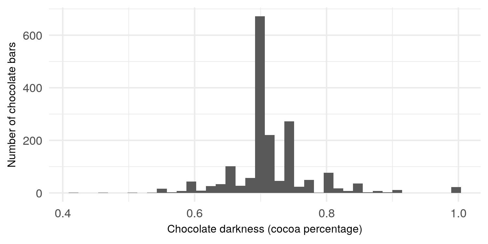

Chocolate bar rating analysis
================
Bailey Lei, George J. J. Wu
November, 2018

Chocolate bar is one of the most popular treats around the world, but
not all chocolate bars are made the same. Some chocolate bars are made
with a high concentration of cocoa beans and are thus considered more
dark, while some chocolate bars are far less concentrated in terms of
cocoa and are thus considered more light.

This begs a question - are darker chocolate bars simply better? For
instance, in the eyes of the experts, are chocolate bars with 99% cocoa
concentration better than chocolate bars with only 79% cocoa
concentration?

This analysis would explore the relationship between chocolate darkness
(cocoa percentage) and chocolate expert ratings.

### Data set

We examined the expert ratings of 1,795 chocolate bars compiled by Brady
Brelinski, a Founding Member of the [Manhattan Chooclate
Society](http://flavorsofcacao.com/index.html). A detailed description
of the data set can be found on
[Kaggle](https://www.kaggle.com/rtatman/chocolate-bar-ratings). We were
particularly interested in two variables in the data - chocolate
darkness (cocoa percentage) and expert ratings.

We began our analysis by examining each variable individually.

### Chocolate darkness

First, we examined the chocolate darkness variable visually.

<!-- -->

*Figure 1.* Distribution of chocolate darkness.

We also examined chocolate darkness numerically.

*Table 1.* Descriptive statistics of chocolate darkness.

| minimum |  q1 | median |      mean |   q3 | maximum |
| ------: | --: | -----: | --------: | ---: | ------: |
|    0.42 | 0.7 |    0.7 | 0.7169833 | 0.75 |       1 |

Note that `q1` represents the 25% quantile, and `q3` represents the 75%
quantile.

Both visual and numerical examinations revealed that the vast majority
of chocolate bars in the data set had a cocoa concentration of about
70%. The most concentrated chocolate bars in the data set attained 100%
cocoa purity, whereas the least concentrated chocolate bars had a cocoa
percentage of only 42%. The distribution of chocolate darkness is
somewhat normal.

### Chocolate expert ratings

Next, we examined chocolate expert ratings visually.

<!-- -->

*Figure 2.* Distribution of chocolate expert ratings.

We also examined chocolate expert ratings numerically.

*Table 2.* Descriptive statistics of chocolate darkness.

| minimum |    q1 | median |     mean |  q3 | maximum |
| ------: | ----: | -----: | -------: | --: | ------: |
|       1 | 2.875 |   3.25 | 3.185933 | 3.5 |       5 |

Note that `q1` represents the 25% quantile, and `q3` represents the 75%
quantile.

Each chocolate bar was rated by experts using a [Likert
scale](https://en.wikipedia.org/wiki/Likert_scale). Some of the main
encodings were: 1 is unpleasant, 2 is disappointing, 3 is satisfactory
(3.75 is praiseworthy), 4 is premium, and 5 is elite. A more detailed
description of the rating system can be found on
[Kaggle](https://www.kaggle.com/rtatman/chocolate-bar-ratings/home).

Most chocolate bars in the data set were given a rating of around 3 to
3.5, with 1 being the lowest rating given, and 5 being the highest
rating given. The distribution of chocolate expert ratings seemed to be
slightly left-skewed.

### Chocolate darkness and expert ratings

Let’s explore the relationship between chocolate darkness and expert
ratings. We would first treat expert ratings as a continuous variable,
followed by analysis in which it would also be treated as a categorical
variable.

#### Expert ratings as a continuous variable

For this part of our analysis, we would explore the relationship between
chocolate darkness and expert ratings, under the assumption that their
relationship to be linear, and that expert ratings to be a continuous
variable.

<!-- -->

*Figure 3.* Chocolate darkness and expert ratings. Grey section
represents 95% confidence intervals for the line of best fit (blue
line), generated using linear regression.

We also computed the [Pearson’s correlation
coefficient](https://en.wikipedia.org/wiki/Pearson_correlation_coefficient)
and its p-value between the two variables.

*Table 3.* Pearson’s correlation coefficient and its
p-value

|    estimate | statistic | p.value | parameter |    conf.low |   conf.high | method                               | alternative |
| ----------: | --------: | ------: | --------: | ----------: | ----------: | :----------------------------------- | :---------- |
| \-0.1648202 | \-7.07589 |       0 |      1793 | \-0.2094894 | \-0.1194644 | Pearson’s product-moment correlation | two.sided   |

There was a negative correlation between the two variables (r = -0.1648,
n = 1793, p \< 0.0001). Both `Figure 3.` and the results in `Table 3.`
seemed to be suggesting that chocolate darkness is weakly and negatively
associated with chocolate expert ratings. In other words, as the cocoa
percentage of chocolate bars increases, chocolate experts tend to give
somewhat lower ratings.

#### Ratings as a categorical variable

### Summary

### Limitations and future directions

### References

  - cocoa versus cacao
